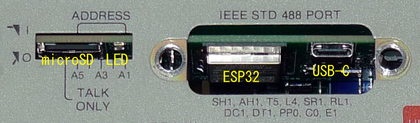

# FlukeNIC - Fluke 884x Web Control & Logger Card

## Overview
The Fluke 884x is an outstanding multimeter.  
Even after 40+ years since its production, most units still function properly and maintain excellent accuracy.  
It's likely more reliable than many cheap modern benchtop meters.  
Its value increases when used in ways unique to benchtop instruments, beyond what handheld meters offer.  
GPIB was the traditional method, but a bit far from modern solution.  
I developed built-in web control and logger card that replaces the original GPIB board.  
NIC ... acronym of Network Interface Card.

---

## Features of This Card
- **WiFi Connectivity**
- **Web-based Control**
- **SD Card Stand-alone Logging**
- **Built-in, No modifications to the main unit required**

---

## How to Get

### 1. Hardware
Currently, no pre-assembled units or kits are available. Please build from the PCB.  
PCB fabrication files (UnitA/B.zip) are for JLCPCB.  
All necessary design materials are in the *hardware* directory.

### 2. Firmware
To program the ESP32, you’ll need to set up the ESP-IDF environment.  
Git clone and *idf.py build* in the *firmware* directory, then download to the ESP32 using a USB-C cable.  
Once written, future updates can be done via OTA.

---

## Help / How to Use

### 1. WiFi Connection
Currently, only WPS push-button WiFi association is supported.  
After installing the board and powering on, press the **SRQ** button repeatedly until the **SRQ** indicator lights up — this signals the WPS request state.  
Once the access point allows WPS, the **SRQ** light turns off and the **LISTEN** light turns on, indicating successful WiFi association.  

Settings are saved to flash memory, so the **LISTEN** indicator should light automatically upon the next power-on.

**Fluke Indicator Summary:**
| Indicator | Meaning |
|-----------|---------|
| SRQ | WiFi WPS Request |
| LISTEN | WiFi Associated |
| TALK | Logging is Active |ESP_ERROR_CHECK

---

### 2. Browser Access
Currently, only DHCP-assigned IPs are supported.  
In most cases, you can access it via:
http://flukenic.local/
If that doesn't work, check the DHCP-assigned IP address on your WiFi router.  
If you got the web interface, you probably won’t need further instructions!

---

### 3. Logging
microSD card is required.  
Start/stop operation can be performed using web-control or front panel **LOCAL** button.  
When logging is active, **TALK** indicator lights up.  
Results can be obtained using File Manager menu, or directly from microSD card, But hot swap is not supported.

---

### 4. Configuration
- Be sure to select the correct model (**8840 / 8842**).
- Other settings are optional.
- All configurations are saved to flash memory.

---

### 5. Troubleshooting
Communication with the Fluke unit is based on reverse-engineering and may malfunction with unexpected inputs.  
In such cases, use the **“Last bytes”** function in the Info menu to inspect the last communication log.  
Feel free to contact me — there may be a fix. Contributions are welcome!

---

### 6. Additional Notes
- SD card hot-swapping is not supported.  
Please insert or remove the card only when the power is off.
- BNC output is not implimented now.